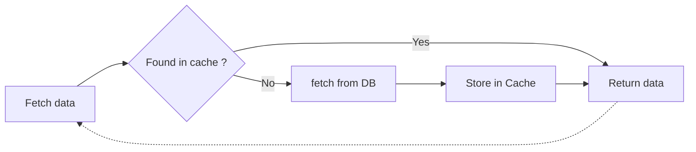

# Caching

- not problem while only you access your page
- an issue arises, when multiple people gets to your page and load - essentially - the same results
- as little queries to DB as possible



## First profile, then optimize

- profiling -> realise, when and what need optimization
- not fresh data - data not up to date in the DB (crucial)

## Storing data

- config: `config.php`
- interacting with the cache:

```php
$mostCommentedPosts = Cache::remember($key, $howLong, function(){
    return BlogPost::mostCommented()->take(5)->get();
});
```

## Removing

```php
$blogPost = Cache::remember("blog-post{$id}", 60, function(){
    return BlogPost::with('comments')->findOrFail($id);
});

// you can handle removing in events
Cache::forget("blog-post-{$id}");
```


## Store some data
```php
Cache::put('key', 'Hello from cache'); // forever
Cache::put('data', 'Hello from cache', 5); // 5 mins

Cache::has('data'); // true
Cache::has('key123'); // false

Cache::increment('counter'); // increments to 2 if 1 before
Cache::decrement('counter'); // back to 1

Cache::get('key');
```

## Tags

- only for redis or memcached

```php
Cache::tags(['people', 'artists'])->put('John', 'Hello I\'m John', 10);
Cache::tags(['people', 'authros'])->put('Anne', 'Hello I\'m Anne', 10);

// Once put with tags, same tags have to be provided for reading

Cache::tags(['people', 'artists'])->get('John');

// Removing based on tags

Cache::tags(['people'])->flush(); // Removes John and Anne
```