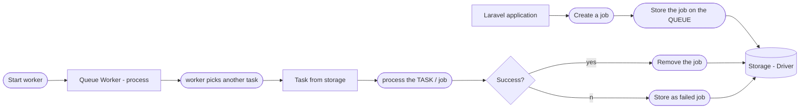

# Queues and Background processing

## Drivers

- Sync
- db
- redis 
- etc ...


## General workflow



## Create jobs table

`php artisan queue:table`

## Making Queueable

- add `ShouldQueue` class on Job/Mail

## Start queue processing

- `php artisan queue:work`

## Debugging

- create queue failed table `php artisan queue:failed-table`
- list: `php artisan queue:failed`
- list: `php artisan queue:retry {id}`

- changes won't be picked up
  - restart needed
  - `php artisan queue:restart`

## Custom job

`php artisan make:job {name}`

### __construct
- constructor when class / job created

### handle()

- code called when job called
  
## Delaying

### Mail

```Mail::to()->later($CarbonWhen, MailJob::class)```

## Rate limiting

- redis
- `Redis::throttle('key')->allow(howMuch)->every(seconds)->then(funtion...)`

## Overwriting number of tries within the class

```php
<?php
 
namespace App\Jobs;
 
class ProcessPodcast implements ShouldQueue
{
    /**
     * The number of times the job may be attempted.
     *
     * @var int
     */
    public $tries = 5;
}
```

## Class timeout time

```php
<?php
 
namespace App\Jobs;
 
class ProcessPodcast implements ShouldQueue
{
    public $timeout = 5; // seconds
}
```

## Queues

- always "default"
- `->onConnection()` - specify connection
- `->onQueue('high')` - specify queue

- give priority to "high" queue
    - `php artisan queue:work --queue=high,default,low`
      - Priority
        1. High
        2. Default
        3. Low